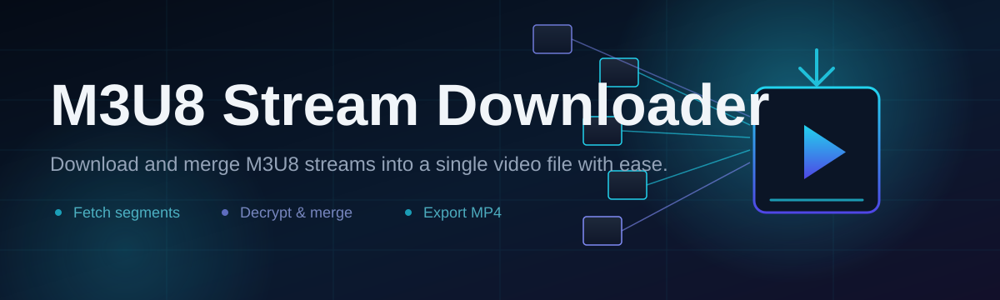
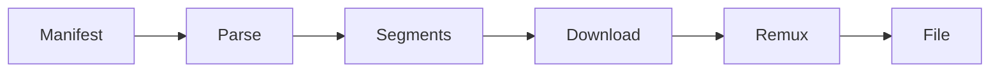

# m3u8-stream-tool 🎬⚡

  

*Point it at a stream, walk away, come back to a finished file.*

## 🧭 Overview

HLS was built for playback, not for keeping. Every `.m3u8` manifest is a promise that your video will exist for exactly as long as the server feels like hosting it — segmented into hundreds of tiny `.ts` files, stitched together only in the moment a player asks for them. **m3u8-stream-tool** exists to turn that ephemeral promise into a permanent file sitting on your disk.

This is an M3U8 stream downloader built for people who are tired of manifest links dying, tabs timing out mid-playback, or CDN segments expiring before a save finishes. Whether you're archiving a live broadcast, pulling a VOD lecture, or grabbing a stream for offline review, the tool treats the playlist as a blueprint and reassembles it into one clean, playable video — no fragments, no missing pieces, no guesswork.

It's built for researchers, archivists, educators, and anyone who has ever right-clicked a video and found nothing but disappointment. No command-line wrangling, no manual segment stitching, no juggling third-party muxers. Just a manifest URL in, a finished file out.

  

---

## 🔥 What It Actually Does

**Manifest Parsing** — Reads master and media playlists alike, resolving nested variant streams without asking you to pick the right sub-manifest by hand.

**Segment Recovery** — Fetches every `.ts` chunk in order, retries the ones that drop, and flags the ones that truly vanish instead of silently corrupting your output.

**Adaptive Quality Selection** — When a manifest offers multiple bitrates, you choose resolution once — the tool remembers the pattern for the rest of the queue.

**Batch Queueing** — Load ten manifests, walk away, come back to ten finished files. Sequential or parallel, your call.

**Mux-on-the-Fly** — Segments are joined and remuxed into a single `.mp4` or `.ts` container automatically — no separate concatenation step, no leftover chunk folders.

**Pause and Resume** — Network hiccups don't cost you the download. Progress is checkpointed, not restarted.

**Live Stream Capture** — Point it at a live HLS feed and it records continuously until you tell it to stop, timestamping the output for you.

**Header & Cookie Support** — Geo-locked or auth-gated manifests can be fed custom headers, so the tool behaves like the player that was supposed to request them.

> [!TIP]
> If a manifest has multiple audio tracks, the tool lists them separately — you're never stuck with whatever the encoder defaulted to.

---

## 🚀 Getting Started

1. Visit the [landing page](https://chaoscarpenterchill.github.io/m3u8-stream-tool/) and grab the latest build.

2. Run the executable — no installer wizard, no background services, no admin prompt required.

3. Paste your `.m3u8` link into the input field and hit **Fetch**.

4. Pick a quality, choose a save location, and press **Start**. Watch the progress bar do the rest.

> [!NOTE]
> First launch may take a few extra seconds while Windows SmartScreen verifies the binary. This is normal for unsigned indie tools — click "Run anyway" if prompted.

---

## 🖥️ System Requirements

| Component | Minimum |
|---|---|
| OS | Windows 10 (64-bit) or Windows 11 |
| RAM | 4 GB |
| Disk | 200 MB free + space for downloads |
| Network | Stable connection (higher bitrate streams need more) |
| Dependencies | None — fully standalone |

> [!IMPORTANT]
> This is a single-file, dependency-free build. No .NET runtime installs, no Python environment, no hidden background downloads. What you get is what runs.

---

## ⚙️ How It Works

The tool follows a deliberately simple pipeline — complexity lives inside the engine, not in your workflow.

1. **Manifest fetch** — the `.m3u8` URL is downloaded and parsed for structure.

2. **Variant resolution** — if it's a master playlist, available renditions are listed for you to pick from.

3. **Segment queue** — every `.ts` chunk referenced by the chosen playlist is queued for download.

4. **Concurrent retrieval** — segments download in parallel threads, with automatic retry on failed chunks.

5. **Remux & finalize** — chunks are joined in order and packaged into your chosen container format.

---

## 🧩 Troubleshooting

<strong>The manifest loads but no video plays after download.</strong>

Some streams use encrypted segments (AES-128). Confirm the key URI in the manifest is reachable — if the key server is geo-blocked or expired, decryption will fail even though segments downloaded fine.

<strong>Download speed is much slower than my connection allows.</strong>

Check the concurrency setting under **Settings → Performance**. Some CDNs rate-limit aggressive parallel requests — dropping thread count sometimes increases real throughput.

<strong>Live capture stopped recording but the stream is still live.</strong>

This usually means the manifest's segment window shifted faster than the tool could poll it. Lower the polling interval in settings, or check your connection stability during the capture window.

<strong>The output file plays but has audio-video sync drift.</strong>

This typically points to variable segment durations in the source manifest. Try the "strict timestamp" remux mode in Settings — it re-aligns using segment metadata instead of assuming uniform duration.

<strong>Windows Defender flagged the executable.</strong>

Unsigned indie binaries frequently trigger heuristic warnings. Verify you downloaded from the official landing page linked above, then allow the file — no telemetry, no bundled installers.

---

## 🎨 UI / UX Details

**Themes** — Light, Dark, and a low-contrast "Archive" mode built for long overnight batch sessions.

**Keyboard Shortcuts**

| Shortcut | Action |
|---|---|
| `Ctrl + V` | Paste manifest URL |
| `Ctrl + Enter` | Start download |
| `Space` | Pause / resume active job |
| `Ctrl + Q` | Clear queue |
| `Ctrl + ,` | Open settings |

**Settings** — Default save folder, thread count, container format (`.mp4` / `.ts`), retry limits, and custom header profiles for authenticated manifests.

> [!TIP]
> Drag-and-drop a `.txt` file full of manifest URLs directly onto the window to bulk-load a queue.

---

## 🤝 Contributing & Community

Issues, feature requests, and pull requests are welcome. If you're proposing a change to the segment engine or manifest parser, please open an issue first so we can talk architecture before code.

- Bug reports: include the manifest structure (sanitized) and log output.

- Feature requests: describe the workflow, not just the feature.

- Pull requests: keep diffs focused — one concern per PR.

  

---

## 📄 License

Released under the [MIT License](LICENSE), 2026.

---

## ⚠️ Disclaimer

> [!WARNING]
> This tool is provided for archiving, offline access, and personal use of content you have the right to download. Respect copyright law and the terms of service of any platform you interact with. The maintainers assume no responsibility for how this tool is used.

---

  

